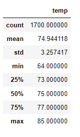
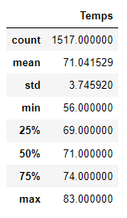

# Overview of the analysis: 
---
Using data from a sqlite database that contains temprature for a date from serveral reporting 
station within Hawaii.  The data is used to perform statictical analysis for a give month to decide
if the weather would impact opening of an ice cream and surf shop on the island of oahu. 
---
## Results: 
---
Provide a bulleted list with three major points from the two analysis deliverables. Use images as 
support where needed.

## Summary: 
---
Provide a high-level summary of the results and two additional queries that you would perform to 
gather more weather data for June and December.